# 时序分析与约束

在上一章中，我们了解了Verilog的语法，使用verilog能轻易地实现时序电路，这可太棒了🥰！但当你设计的电路在仿真中能取得正常的波形的时候，你是否以为你的设计能够在真正的FPGA芯片上完美的运行？在你的设计中，可能有成百上千的寄存器在监控某些信号，你应该如何确保这些信号能够在每个时钟上升沿到达这些寄存器，会不会有一些来迟了？会不会有一些信号虽然到的很准时，但是维持的时间不够以至于寄存器没抓住它？你会说，仅凭借Verilog设计，我如何知道哪些信号会迟到早退？EDA工具肯定以及帮我安排好了！其实，很大程度上，这些工具是通过实现你给他们的时序约束（timing constraints来保证 FPGA 的稳定运行的。这是你和工具之间的交易： 只要 FPGA在其允许的温度和电压范围内运行，您就可以准确地表达时序要求，并且这些工具可以确保在您使用的任何 FPGA 上都能实现这些要求。

在这一章中，我们将详细的介绍时序分析技术，并教会你怎么去看vivado的时序报告并以此得出解决时序问题的方法。笔者曾经天真的认为RTL设计在任何时钟频率下都能跑，于是笔者在FPGA上部署的第一版声学相机的输出长这样：

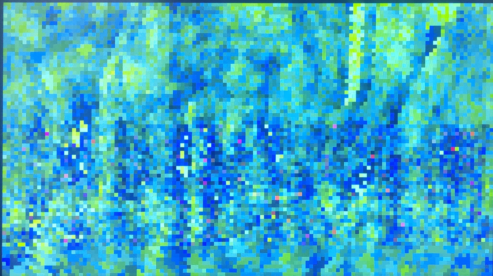

我修正了时序，之后它的输出长这样：

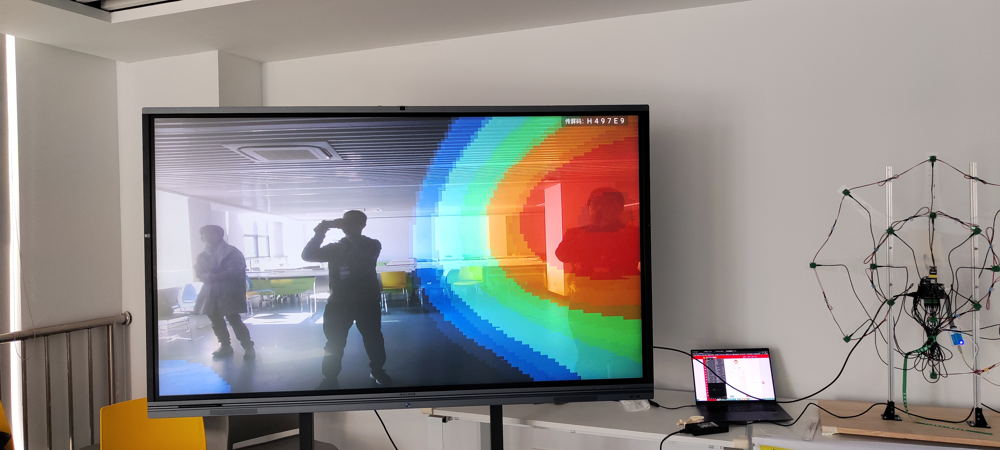

这会成为我们后边分析时序违例的例子之一。

# 静态时序分析

静态时序分析最关心的就是一个DQ触发器的时钟信号和数据信号之间的时序关系，以下我们将介绍两个概念，建立时间和保持时间来描述这两种关系。

* **建立时间 Setup Time**是指数据维持稳定到有效时钟沿来临的时间。

* **保持时间 Hold Time**是指有效时钟沿过去之后数据能够保证稳定的时间。

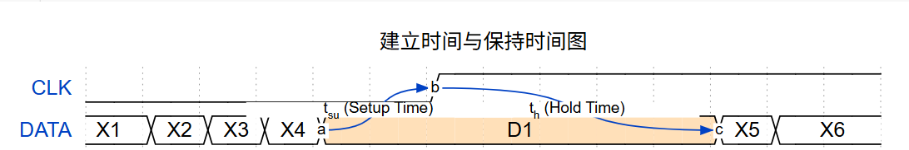

* **时钟抖动time jitter** 在FPGA上，你构建的模块的时钟输入一般来自于外部晶振或者是片上pll，但是，由于温漂或是器件内布线的影响，这些器件给出的频率存在误差。时钟抖动指的是时钟信号两个周期时长的差值。
  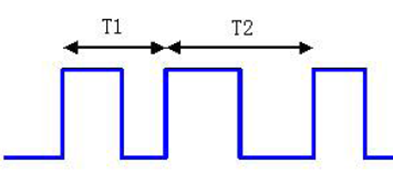

* **时序裕度 slack** （slack译作松弛、松弛的）对于不同工艺的触发器，触发器所要求的建立时间和保持时间的最小值$\min(t_{su})$和$\min(t_h)$各不相同，为了衡量$t_{su}$，$t_h$和$\min(t_{su})$，$\min(t_h)$的关系，我们称$t_{su}-\min{t_{su}}$为建立时间裕度，$t_{h}-\min{t_{h}}$为保持时间裕度。在FPGA综合工具上，这两个裕度值往往还需要减掉时钟抖动时间$t_{jitt}$，如果Implement 结束之后的时序报告中这两个时序裕度为正，表明你的设计能够在工作温度下正常的运行。

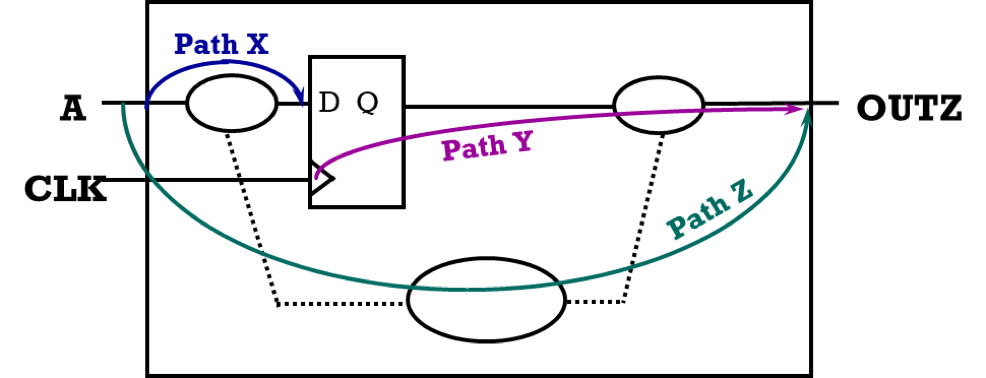

静态时序分析主要包含三个步骤：

1. 将RTL网表拆成若干时序路径（从D到下一个Q之间的所有器件与连线成为路径）

2. 依次计算每条路径的延时

3. 判断路径延迟是否时序约束（时序约束包含时钟频率、时钟抖动等重要信息）

因此，一个RTL设计的时钟频率越高，留给每条时序路径的时间就越短（往往只能容纳几个门电路）。为了达成较高的时钟频率，你将不得不把长的时序路径用DQ触发器分割开来🙀！

一般来说，对于常见的CMOS电路，温度升高，时序路径的延迟会增大。这意味着在高温下，电路可能无法达到同样的最高工作频率，因为延迟增大了，需要更长的稳定时间。（如果你学过/正在学半导体物理，你一定会清楚的知道温度对芯片的影响有多大！）所以一些显卡在温度较高的情况下会降频来确保每条时序路径的延迟在可接受范围内，确保结果正确——如果它不降频，可就要花屏了！

# 看看时序报告

如果有人跟你说：我的FPGA设计为啥早上晚上能运行，中午不能？开着空调能运行，关了就不能？你就对他说：看看时序报告！

（虽然温度对半导体电阻率的影响是以百开尔文为尺度衡量的，但真的不排除有上述的情况出现）

接下来，我就带大家看看我的出版声学相机，它为什么跑不起来？

对于已经完成Implement的工程，打开vivado界面的Poject Summary或者是Design runs标签页，一眼就能看到你的最差时序裕度（WNS）！（据Xilinx的工作人员在答疑论坛上说，vivado布线用的神经网络会优先保证保持时间，所以一般是建立时间出现负slack。）

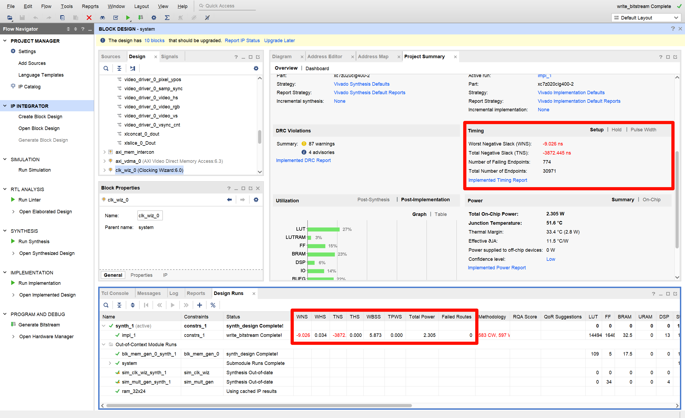

天哪！这个设计的主频只有100MHz，也就是说留给每条时序路径的时长有10ns，但最差时序裕度居然有9.026ns！（时序裕度为负表示距离满足最小建立或保持时间还需要的时长），足足差了一倍，怎么办😨?

让我们来看看是哪些路径这么耗时🧐，在左边栏点击Open Implemented Design查看布线报告！

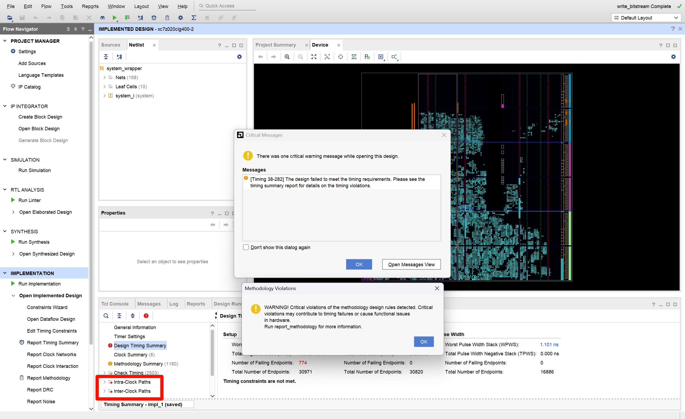

当源时钟和目的时钟来自于同一个时钟信号（这个时钟信号可以是PLL或者MMCM产生的时钟，可以是I/O clock pins等）就称为Intra-clock Paths，如下图：

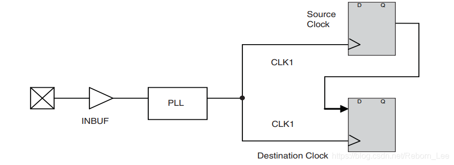

与之相对的是Inter-clock Paths，很好理解，源时钟和目的时钟来自于不同的时钟域，如下图：

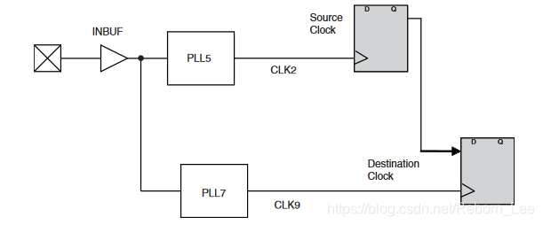

我们依次来看看这两种时序路径，首先打开Intra-clock path栏目：

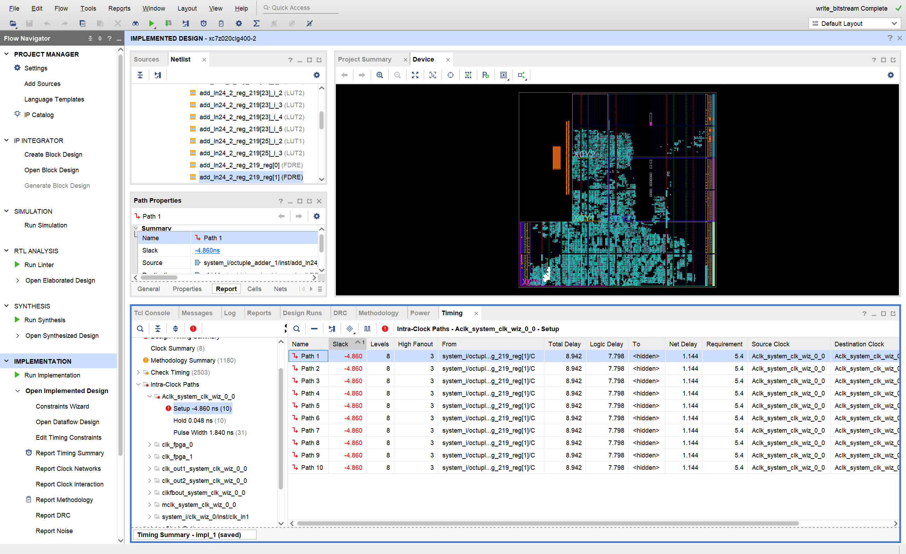

我们可以发现，是Aclk这个时钟（由system_clk_wiz_0_0产生，Xilinx式命名是这样的）域下的信号时序违例了！在Timing标签页中的右边栏展示了裕度最差的10条路径（可以点击左边栏Report Time Summary展示更多），每条都展示了Slack值，时序路径上的器件等级（Level，也就是延迟相当于多少个LUT的延迟，一般来说和路径上的器件数差不了太多），源被多少其他器件使用（High Fanout）以及从哪里来（From，源寄存器）。

从上面关于时序路径的描述你就可以看出，一条时序路径上的串连的器件越多（Level），那延迟肯定越长！为什么并联的器件多（High Fanout），延迟也会变长呢？在《工程电路分析》一书中曾经提到两个逻辑器件之间的连接可以用一个RC模型来描述，其中，器件输出从0变化到1的上升时间就是电容的充电时间。而并联的器件多了，源输出就要同时给每个电容充电，这时充电的速度相应减缓了，也就是这条路径上每个器件的延迟都变长了！

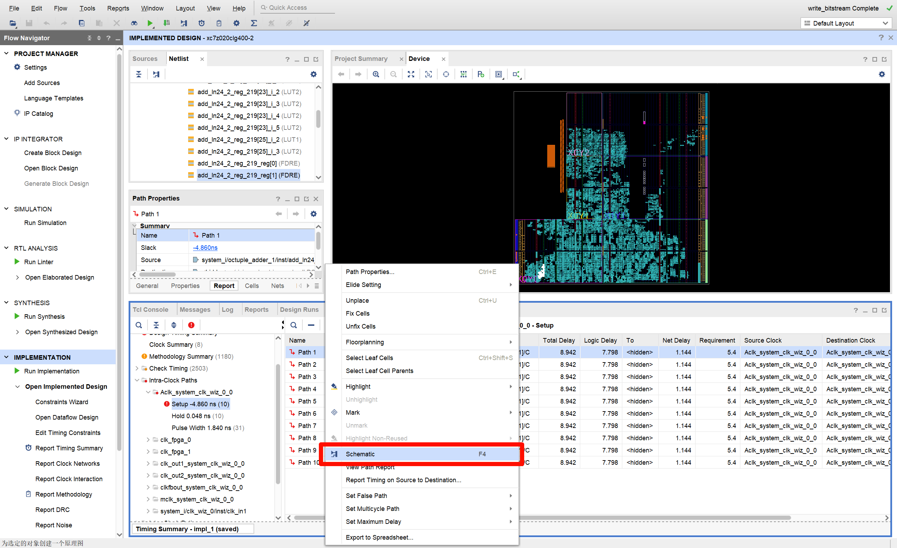

右键时序路径即可查看对应的原理图（不看原理图你压根就不知道出问题的是那个寄存器，由于综合和布线的时候一些寄存器被重命名了，那个From一般是不靠谱的！😅）

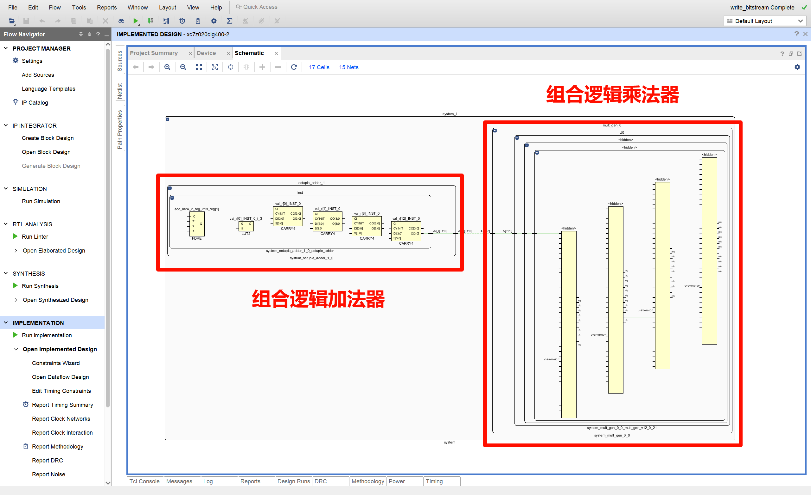

打开原理图一看，这条路径上又有组合逻辑加法器，又有组合逻辑乘法器，难怪炸了！

所以，只要在加法器和乘法器中间打一拍（插入一个寄存器），就能解决这类路径上的时序问题！

（这个加法器的位宽是64，所以每一位都会形成这样的时序路径，打这一拍就能解决掉64条违例，这样看来，总违例路径数774一点也不多嘛！）

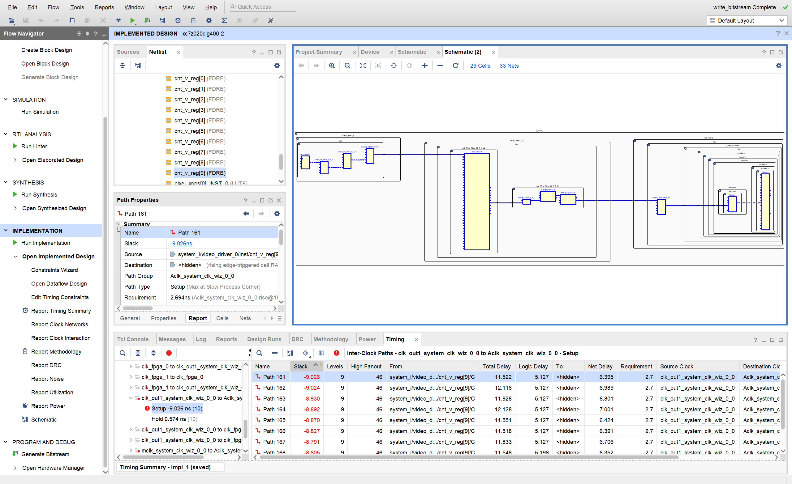

我们再来看Inter-clock path，跨时钟域信号传输真不愧是FPGA设计上的难点，一不小心就容易造成大时序错误！（讲个故事：笔者在打集创赛的时候在答疑会上听闻了一个奇人，他做的处理器每个流水级都工作在不同的时钟域上，是一个异步处理器。虽然综合出来slack有几十万，但是真的能正确运行！🤯🤯🤯真是太令人震惊了，这位奇人简直是人形EDA。但请谨记，他可以是人形EDA，但你大概率不是！跨时钟信号传输出现负slack要及时解决，要是放着的话迟早出问题）

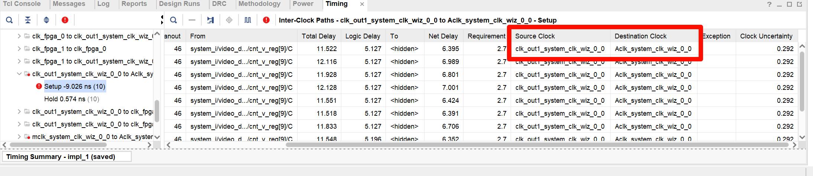

这里，我们要重点关注Source Clock和Destination Clock这两项。可以看到，这条路径的源寄存器是HDMI输出时钟域的（144MHz），但重点却是主时钟域（100MHz）的！

由于这是从快时钟域向慢时钟域传输，因此解决方案以将源寄存器为输入，在主时钟域打两拍，再传入后续逻辑。对于其他的跨时钟域信号传输问题，我们留到《FPGA常见设计元素》这一章去讲。

# 

